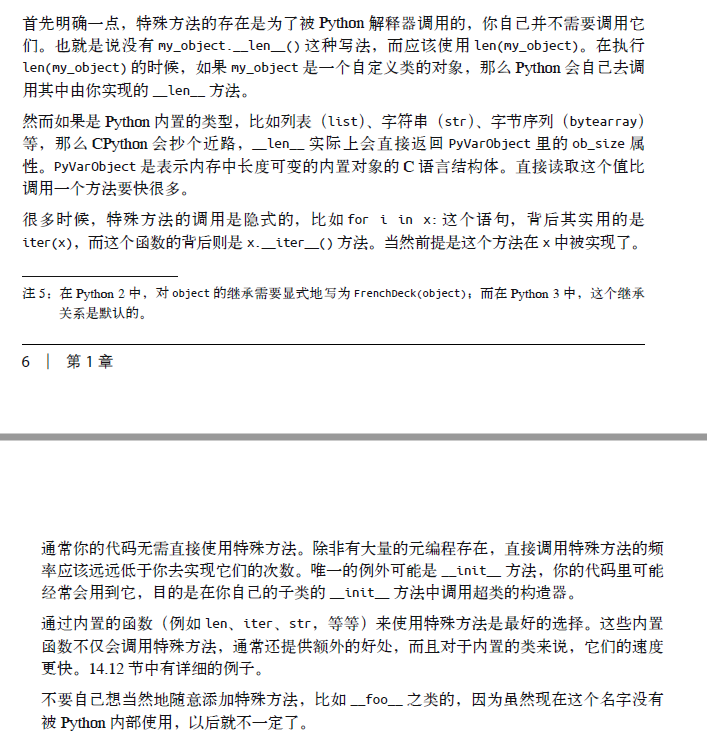
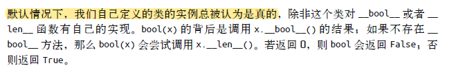
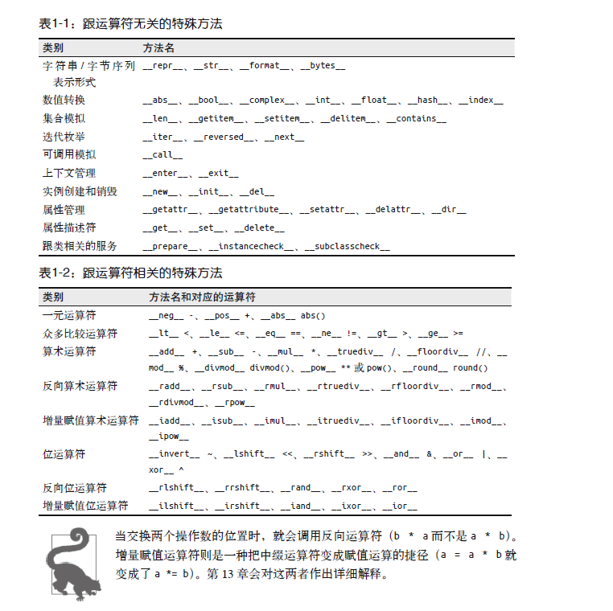
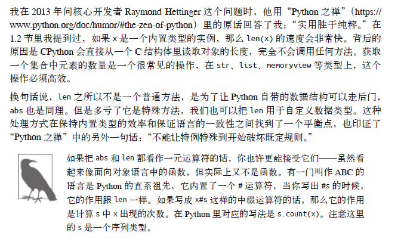

[TOC]


# 第一章 Python数据模型

## 1.1 一撩Python风格的纸牌

作者用了一个生动形象的例子来到处Python中的特殊方法

```python
import collections

Card = collections.namedtuple('Card', ['rank', 'suit'])

class FrenchDeck:
    ranks = [str(n) for n in range(2, 11)] + list('JQKA')
    suits = 'spades diamonds clubs hearts'.split()

    def __init__(self):
        self._cards = [Card(rank, suit) for suit in self.suits
                                        for rank in self.ranks]

    def __len__(self):
        return len(self._cards)

    def __getitem__(self, position):
        return self._cards[position]

```

- 新知识：==collections.namedtuple==

这个方法从python2.6以后加入，用以构建只有少数属性但是没有方法的对象。在本例中就创建了一个名为Card的类，其拥有rank和suit两个属性。

- 当我们给一个类对象实现了`__getitem__()`之后，该类对象就能够支持`切片`和`迭代`操作了。

- 特殊方法的使用事项

总结来说就是：尽量使用内置的函数来调用特殊方法，直接调用特殊方法的频率应该远远小于自己低于自己去实现它的次数。




## 1.2 模拟数值类型

### 1.2.1 数值运算

通过给类实现特殊方法，我们就可以让类进行加减乘除、取模、打印字符串信息等操作。

在下面这个类示例中，我们通过写特殊方法实现了向量类的取模，加，乘运算：

- abs：取模
- add：加
- mul：乘

```python
from math import hypot

class Vector:

    def __init__(self, x=0, y=0):
        self.x = x
        self.y = y

    def __repr__(self):
        return 'Vector(%r, %r)' % (self.x, self.y)

    def __abs__(self):
        return hypot(self.x, self.y)

    def __bool__(self):
        return bool(abs(self))

    def __add__(self, other):
        x = self.x + other.x
        y = self.y + other.y
        return Vector(x, y)

    def __mul__(self, scalar):
        return Vector(self.x * scalar, self.y * scalar)

```


### 1.2.2 字符串表示形式

在上面的这个类中我们观察到了一个`__repr__`的特殊方法，这个方法其实就是用于==把一个对象用字符串的形式表达处理以便辨认==，有点类似与重写c#中ToString()方法，这一当我们在控制台中进行print的时候就能按照我们所写的方法进行打印。复现`__str()__`也能够实现相同的目的，区别在于`__str__`在str()函数中被使用。

有两位大咖在StackOverflow中对两者进行了精彩的讨论：https://stackoverflow.com/questions/1436703/difference-between-str-and-repr

- 如何在`__str__`与`__repr__`中做选择？

如果你只想实现两种方法中的一种，建议实现`__repr__`

### 1.2.3 算术运算符

同add,mul等的说明

### 1.2.4 自定义的布尔值

默认情况下，我们自己定义的类的实例总被认为真的，除非我们对`__bool__`或者`__len__`函数有自己的实现。对于`__len__`，需要说明的是如果len()返回0则判定对象的布尔值为False。



```python
class myTest():
    def __len__(self):
        return 0

a = myTest()
print(bool(a))
'''输出信息为False'''
```

## 1.3 特殊方法一览

官方文档讲解83个特殊方法：https://docs.python.org/3/reference/datamodel.html



## 1.4 为什么len不是普通方法



## 1.5 本章小结

如果有兴趣还可以阅读著名的Python Cookbook


