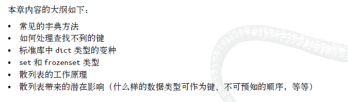
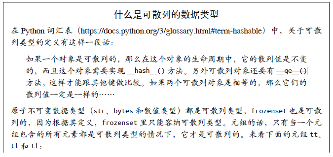
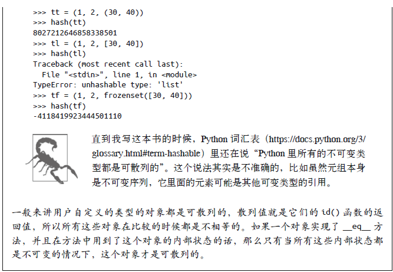
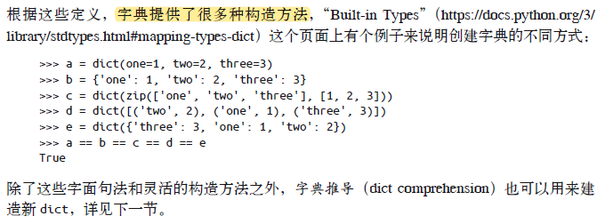
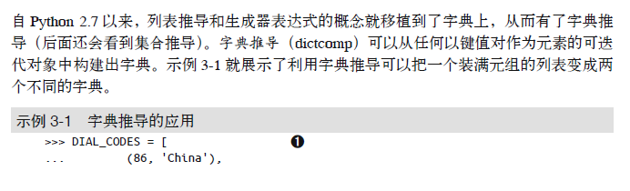
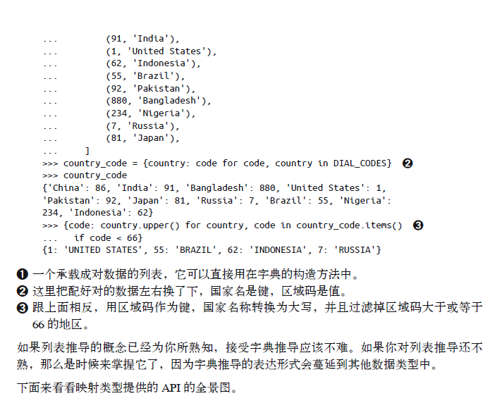

# 第三章 字典和集合

[TOC]

# 大纲



# 1 泛映射类型

泛映射类型的定义晦涩难懂，这一小节我们先理解什么是散列的数据类型。

如何理解在这个对象的生命周期中，它的散列值还是不变的？

请看如下代码，对于散列的数据列表字符串，如"a"，在一个脚本的运行期间，获取"a"的对象的散列值都是相同的，并且在所有的"a"对象结束之前，以后的对象获取"a"，他们的散列值都是相同的，这就是散列值不变。但我们重新运行脚本，因为之前的对象都已经结束生命了，所以有可能出现不同的散列值。

```python
a = "a"
print(hash(a))
b = "a"
print(hash(b))
a = "b"
print(hash(a))
#第一次运行输出：
#-6858798902269374304
#-6858798902269374304
#5783132282193660308
#第二次运行输出
#-1526125446227151740
#-1526125446227151740
#6674741029001075992
```








# 2 字典推导





# 3 常见的映射方法

