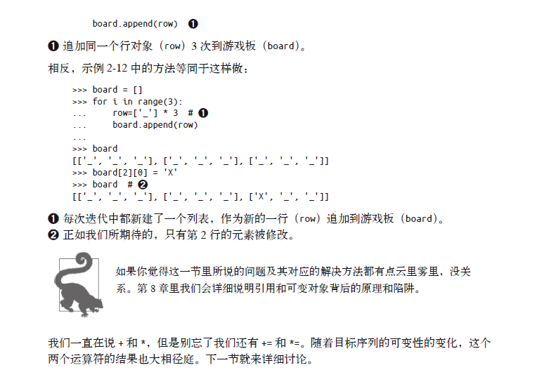

# 第二章 序列构成的数组

# 1 内置序列类型概览

在学习流畅的Python之前，初学者可能只知道Python的List以及dict两种数据结构，其实Python的数据结构十分丰富，**内置序列类型**就有很多种。


# 2 列表推导和生成器表达式

## 2.1 定义

**列表推导**是构建列表的快捷方式，而**生成器表达式**则可以用了创建其他任何类型的序列。

作用：使用他们可以让我们的代码更具可读性且更加高效。


## 2.2 列表推导

### 2.2.1 可读性

列表推导的唯一作用是创建新的列表，他让你的代码更具可读性，但请注意：**在写列表推导时请尽量保持代码的简短，如果列表推导的代码超过了两行，你就要考虑是不是得用for循环重写了**

请注意Python会忽略[] {} ()中的换行：

不过事实上当我们使用Python3.x在pycharm中编程的时候并没有碰到这个换行问题。


在Python3.x之后列表推导不会再有变量泄漏的问题：


### 2.2.2 速度与效率


我们运行了作者提供的代码，效果如图：


### 2.2.3 笛卡尔积


### 2.2.4 生成器表达式

#### 1 初始化元组和数组


#### 2 节省内存

更多的细节会在14章进行讨论。


## 2.3 元组不仅仅是不可变的列表


### 2.3.1 元组和记录


### 2.3.2 元组拆包

#### 1 定义


#### 2 平行赋值

平行赋值是最好辨认的元组拆包形式了，可以把元组中的值直接拆包赋值出来。


#### 3 不使用中间变量交换两个变量的值

这是Python中一个非常优雅的写法，额可以不使用中间变量交换两个变量的值。

```python
b,a = a,b
```

#### 4 用*运算符合拆包作为函数的参数


#### 5 用*处理剩下了的元素


### 2.3.3 嵌套元组拆包

在这里我们学习到了一种新的字符串打印格式，


### 2.3.4 具名元组 namedtuple

- collections.namedtuple

  这是一个工厂函数，它可以用来构建一个带字段名的元组和一个有名字的类——这个带名字的类对调试程序有很大帮助。

  


创建具名元组的两种方式

```python
form collections import namedtuple
# 演示创建City具名元组，属性有name country population coordinates
City = namedtuple('City','name country population coordinates')
# 第二种方式：
# City = namedtuple('City',['name','country','population','coordinates'])
tokyo = City(name='Tokyo',country='JP',population=36.933,coordinates=(35.689722,139.691667))
```


- 除了从普通元组那里继承来的属性之外，具名元组还有一些自己专有的属性。

  接下来展示几个最有用的：`_fields类属性`、`类方法_make(iterable)`和实例方法`_asdict()`。

  

### 2.3.5 作为不可变列表的元组


## 2.4 切片

在Python里，像列表list、元组tuple和字符串str这类序列类型都支持切片操作，但实际上切片操作比人们所想象的要强大得多。这里我们要介绍的是切片的高级知识。

```python
# 字符串切片示例
a = "Abvc"
print(a[:2])
#输出：Ab
```

### 2.4.1 为什么切片和区间会忽略最后一个元素


### 2.4.2 对对象进行切片


### 2.4.3 多维切片和省略

- 多维切片

  其实多维切片的操作我们在操作Numpy以及tensor对象时经常使用，但是Python标准库本身却没有这个用法。这些句法上的特性是为了支持用户自定义类或扩展。

  

- 省略

  

  

### 2.4.4 给切片赋值


## 2.5 对序列使用+和*

使用+可以方便地对序列进行拼接，使用*可以方便地对序列进行复制。


- 警告


### 2.5.1 建立由列表组成的列表

#### 1 正确做法(使用列表推导)

 


#### 2 错误的做法与错误的本质

接下来展示一个错误的建立列表组成的列表的方法(含有n个指向同一对象的引用的列表是毫无用处的)

即：不要将**同一个对象的引用**复制添加




## 2.6 序列的增量赋值


对于可变序列，会进行就地加法和乘法，但是对于不可变序列，就是创建一个新的对象，将原来对象的元素先复制到新的对象里，然后再追加新的元素。


### 2.6.1 一个关于+=的谜题

当我们对元组中的课表对象进行扩展时，会抛出异常，但是扩展仍然会成功。


## 2.7 list.sort方法和内置函数sorted

list.sort对List进行就地排序，返回值为None。

sorted(list)会创建一个副本，对副本进行排序并返回排序好的副本。

### 2.7.1 两种方法的参数


## 2.8 用bisect来管理已排序的序列


### 2.8.1 用bisect来搜索

bisect()函数有两个必选参数，第一个参数表示要被排序的序列，第二个参数表示要插入的元素。

- 可选参数lo和hi

  lo和hi用了缩小搜索范围，表示从index为lo，长度为hi的范围内对序列进行插入元素排序。

  测试效果差异如图：

  

- 此外，bisect.bisect()默认是将元素插入到相等的元素的右边，如果想插入到序列相等的元素的左边，就需要调用bisect.bisect_left()。这些函数返回的只是索引的位置，然后需要调用 `序列.insert(index,插入元素needle)`将元素插入到序列中。


- bisect的一个有趣的应用就是可以用了建立一个数字作为索引的查询表格，比如把分数和成绩等级对应起来。

  见下图:

  

### 2.8.2 用bisect.insort插入新元素


## 2.9 当列表不是首选时

针对一些不同的操作，我们有比列表更优的数据结构。


### 2.9.1 数组

创建数组时，我们需要一个类型码，像C语言一样指定数组中存放怎样的数据类型。此外，我们能将数组保存成`二进制.bin文件`方便地进行读写，实验证明读写二进制文件比读些文本文件快60倍。

总而言之，如果序列中只是数字，我们尽可能的用数组来处理它吧。


### 2.9.2 内存视图


### 2.9.3 NumPy和SciPy

NumPy和SciPy是两个强大的科学计算库，其实现基于C语言和Fortran代码，正是因为这两个库，使得Python成为科学计算的主流语言。


### 2.9.4 双向队列和其他形式的队列

纵然我们可以用列表来实现栈以及队列的功能。比如通过append以及pop(0)来模拟栈的先进先出，但是删除列表的第一个元素之类的操作是非常耗时的，因为这些操作会牵扯到移动列表里的所有元素。

- maxlen是一个可选参数，用于指定这个队列可以容纳的元素的最大数量，==而且一旦设定，这个属性就不能修改了==

- dq.rotate(n)

  这是队列选择操作，当n>0时，将队列最右边的n个元素移动到队列的左边；当n<0时，将队列最左边的n个元素移动到队列的最右边。

- dq.extendleft(iter)方法：见⑤


# 3 本章小结


